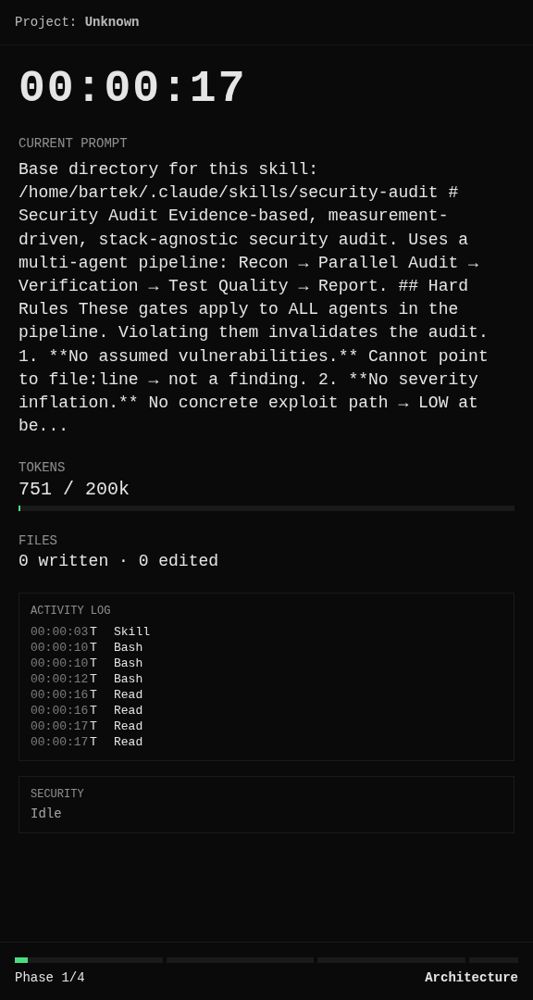

# silent-build

**Post-processing pipeline for viral "silent coding" YouTube videos.** Parses Claude Code `.jsonl` sessions into a mission-control style Dashboard PNG sequence, rendered via Remotion, ready to drop next to OBS screen recording in CapCut.

> Repo: https://github.com/bartek-filipiuk/silent-build
> License: [MIT](./LICENSE)
> Status: **MVP pipeline working · visual redesign in progress** (NASA mission-control style, see `docs/design-brief.md`)



*(render z sesji security-audit Drupala — 7 widgetów, dark mode, real data z `.jsonl`. Aktualny "before state" przed Claude Design redesignem.)*

## Architektura

Monorepo pnpm workspaces:
- `@silent-build/shared` — Zod schemas, TS types (kontrakt między paczkami)
- `@silent-build/theme` — design tokens + fonts
- `@silent-build/ui` — widgets + compositions (Dashboard, Intro, Outro, PhaseTransition, Thumbnail) + AnimationCtx
- `@silent-build/markers` — CLI, zapisuje manual phase markers (`--live` flag postuje do live-server)
- `@silent-build/harvester` — CLI, parsuje `.jsonl` sesję → `timeline.json`
- `@silent-build/curator` — CLI, łączy wiele sesji → `candidates.json` (top-50 fragmentów wybranych heurystykami)
- `@silent-build/overlay` — Remotion project: renderuje single timeline lub multi-scene `narrative.json` → MOV
- `@silent-build/live-server` — SSE server + jsonl watcher dla live streamingu
- `@silent-build/live-dashboard` — Vite/React, 3 entry points (`/dashboard/`, `/overlay/`, `/control/`) dla OBS

Specs:
- `docs/superpowers/specs/2026-04-21-silent-build-design.md` (MVP pipeline)
- `docs/superpowers/specs/2026-05-05-curator-best-of-design.md` (best-of multi-session)

## Best-of multi-session films (curator + skill)

Dla projektów rozłożonych na wiele sesji Claude Code (np. fastduels.com — 4 jsonl-e, 9 dni pracy):

```bash
# 1. instaluj skill (raz)
pnpm skill:install

# 2. skanowanie heurystykami → candidates.json
pnpm curate:scan --project ~/.claude/projects/-home-bartek-games-projects-myproject \
                 --out output/myproject-candidates.json --name myproject

# 3. interaktywna kuracja w Claude Code
claude
> /curate-narrative output/myproject-candidates.json

# 4. render każdej sceny do osobnych MOV-ów + manifest.json
pnpm render:narrative --input output/myproject-narrative.json --out output/myproject-final
```

Output: per-scene Intro/PhaseTransition/Outro overlays (1920×1080) + per-clip Dashboard segmenty (576×1080) + `manifest.json` + ffmpeg concat lists. Sklejka w CapCut albo `ffmpeg -f concat -c copy`.

Reference: `output/duels-narrative.json` (12-min film, 6 scen, 12 clipów).

## Wymagania

- Node 22+ (dziala tez na Node 20.11+ z warningiem)
- pnpm 9+

## Setup

```bash
pnpm install
pnpm test         # wszystkie paczki
pnpm typecheck
```

## Workflow per film

1. **Przed sesja:**
   ```bash
   pnpm mark project-start --name "FocusFeed"
   # zapisz komende `export SILENT_BUILD_DIR=...` z outputu
   ```

2. **OBS:** rozpocznij nagrywanie -> `output/focusfeed-<date>/screen.mp4`

3. **Claude Code:** koduj jak normalnie. Sesja sie loguje do `~/.claude/projects/.../<session-uuid>.jsonl`

4. **Na zmianach faz (w trakcie sesji):**
   ```bash
   pnpm mark backend-start
   pnpm mark frontend-start
   pnpm mark security-start
   pnpm mark polish-start
   ```

5. **Po sesji — harvest + render:**
   ```bash
   pnpm harvest --project $SILENT_BUILD_DIR
   pnpm render --project $SILENT_BUILD_DIR
   ```

6. **Montaz w CapCut:**
   - Import `screen.mp4` (70% lewa)
   - Import `dashboard_frames/` jako image sequence (30% prawa)
   - Sync po pierwszej klatce, ciecia, tempo, muzyka, thumbnail

## Struktura

```
packages/
  shared/       # typy i schematy (Zod)
  markers/      # pnpm mark <phase>
  harvester/    # pnpm harvest
  overlay/      # pnpm render / pnpm studio
output/
  <project>-<date>/
    manual_markers.json
    timeline.json
    screen.mp4              # gitignored
    dashboard.mov           # gitignored
    dashboard_frames/       # gitignored
docs/
  superpowers/
    specs/                  # design docs
    plans/                  # implementation plans
scripts/
  smoke-e2e.sh              # end-to-end verification
```

## Development

- `pnpm studio` — Remotion Studio z mock timeline, hot reload dashboardu
- `pnpm test` — Vitest we wszystkich paczkach
- `pnpm typecheck` — TS check we wszystkich paczkach
- `./scripts/smoke-e2e.sh` — pelen pipeline na biezacej sesji CC (renderuje 60 klatek dla szybkiej weryfikacji)

## Visual redesign (in progress)

Dashboard aktualnie wygląda funkcjonalnie ale surowo (inline styles, brak ikon, brak animacji). Trwa redesign do stylu **NASA mission control** (amber/green indicators, grid lines, monospace typography hierarchy).

Plan faz:
1. **Foundation** — public repo, design brief, reference frames ← *you are here*
2. **Design tokens** — refactor hex'ów do `theme/tokens.ts` (zero visual change)
3. **Dashboard redesign** — brief → Claude Design → adapt → Remotion 60fps
4. **New compositions** — IntroCard, OutroCard, PhaseTransition, Thumbnail generator
5. **Logo + polish** — brand mark, wordmark, usage docs

Design brief dla Claude Design: `docs/design-brief.md`

## Linki

- Design spec: `docs/superpowers/specs/2026-04-21-silent-build-design.md`
- Implementation plan: `docs/superpowers/plans/2026-04-21-silent-build-pipeline-mvp.md`
- Visual redesign plan: `docs/design-brief.md`
